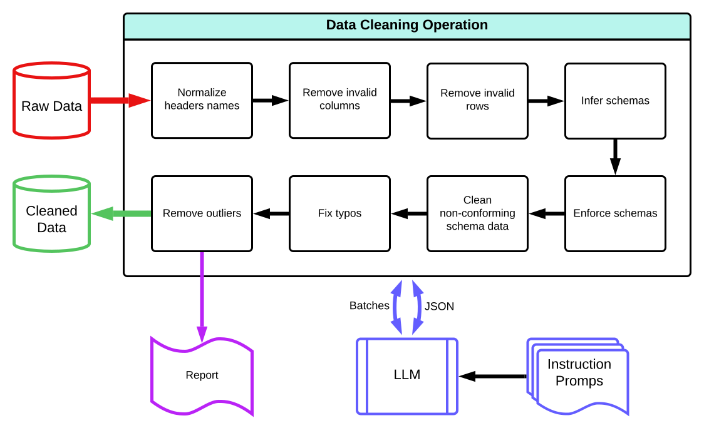

# AI Data Cleaning and Reporting Tool
This project focuses on automating the initial steps of data preparation using LLM to provide smart, context-aware data cleaning. While it can handle the primary cleaning tasks, its goal is to prepare small to medium datasets for more in-depth and complex transformations downstream.

[App](https://huggingface.co/spaces/reab5555/Data-Cleaner)

## Features
- **Column Header Normalization**: Auto-corrects and standardizes column headers.
- **Empty Data Removal**: Prunes columns and rows with substantial missing values.
- **Low Count Category Removal**: Cleans categorical columns by eliminating infrequent values.
- **Data Type Enforcement**: Determines and enforces appropriate data types for columns.
- **Typo Detection and Correction**: Spot and fix potential typos in string columns.
- **Outlier Removal**: Identifies and removes outliers from numeric columns.
- **Visualization Reports**: Generates detailed reports to visualize data before and after cleaning.

#### How Batch Processing Works
1. **Divide Data into Chunks**: Split the data into manageable batches to avoid token limit.
2. **Process Each Chunk**: Apply cleaning functions to each batch individually.
3. **Merge Results**: Combine the cleaned batches back into a single dataset.

#### Inferring Column Schemas
The tool uses LLM's understanding of data patterns and statistical methods to infer column schemas:

1. **Sampling**: Within each batch, sample data points to get a representative understanding of the column.
2. **Analyze Data Types**:
   - **Numeric Columns**: Check if data follows numeric patterns and enforce numeric types (e.g., integer, float).
   - **Categorical Columns**: Observe different unique values to determine categorical types.
   - **String Columns**: Identify consistent string patterns, fix typos, and normalize values.
3. **Contextual Inference**: LLMs help in understanding contextual clues from headers and existing data to predict the most appropriate data types.
4. **Consistency Check**: Ensure uniform data types and schemas are maintained across batches.
   
## Advantages
Using LLMs with prompts over traditional methods offers several benefits:   
- **Intuitive and Context-Aware**: LLMs understand the context and provide intelligent suggestions.   
- **Flexible and Adaptive**: Adapts to various data structures and types without hardcoding.   
- **Reduced Manual Effort**: Automated processes save time and reduce manual interventions.   
- **Enhanced Error Detection**: Detects and corrects subtle errors and inconsistencies.   
- **Scalability**: Efficiently handles large datasets by processing data in batches.
- **Time-Saving**: Automates repetitive data cleaning tasks.
- **Improved Data Quality**: Ensures data is clean and ready for analysis.
- **Comprehensive Reports**: Visual insights aid better decision-making.
- **Ease of Use**: Simplifies data cleaning, accommodating various user expertise levels.

## Steps of Data Cleaning
1. **Normalize Column Headers**: Ensure consistent and valid column names.
2. **Remove Empty Columns**: Drop columns with less than 50% valid data.
3. **Remove Empty Rows**: Drop rows with less than 50% valid data.
4. **Remove Low Count Categories**: Clean categorical columns by removing infrequent values.
5. **Clean Columns**: Process each column in batches and handle non-conforming cells.
6. **Remove Outliers**: Detect and remove outliers from numeric columns.

